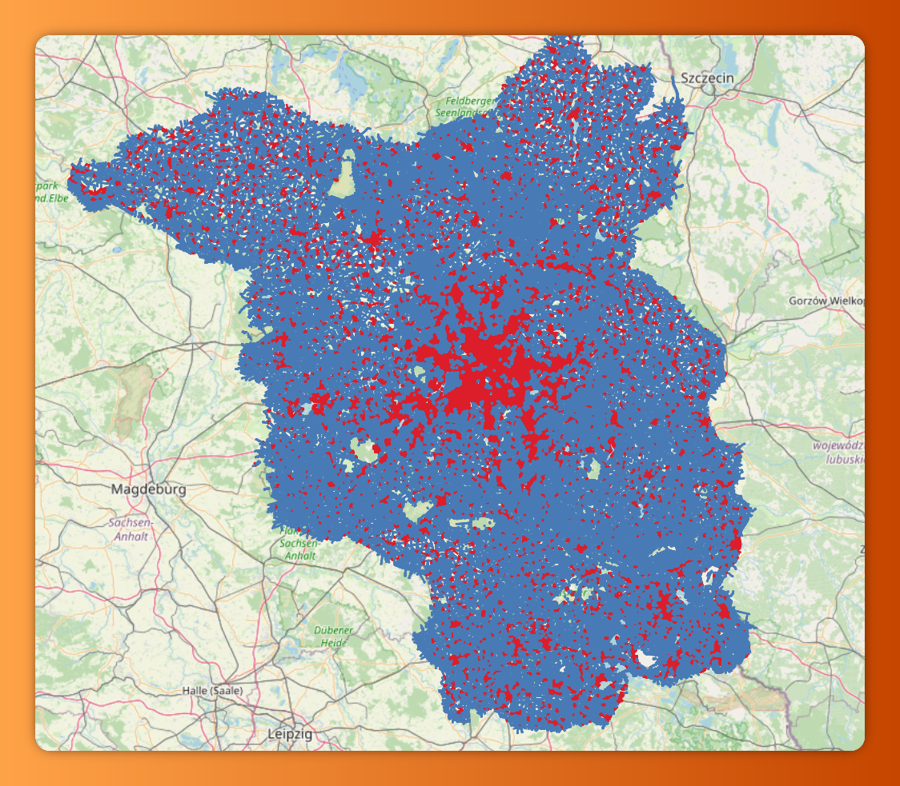
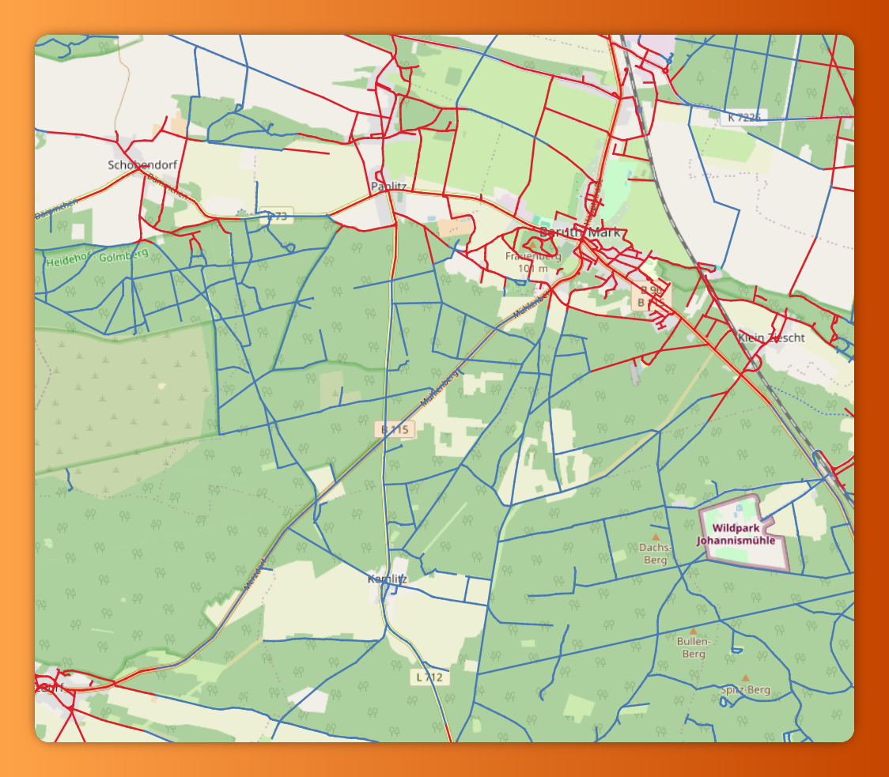
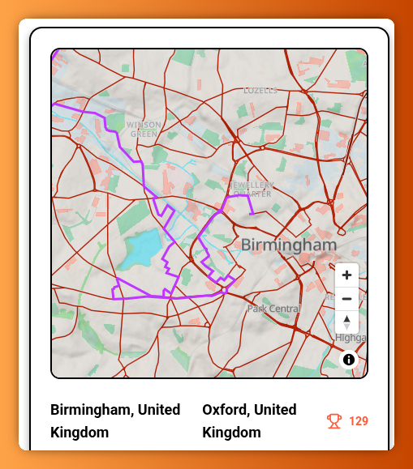
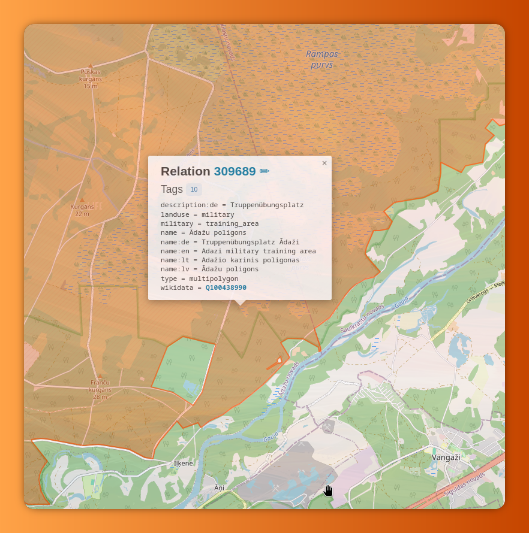
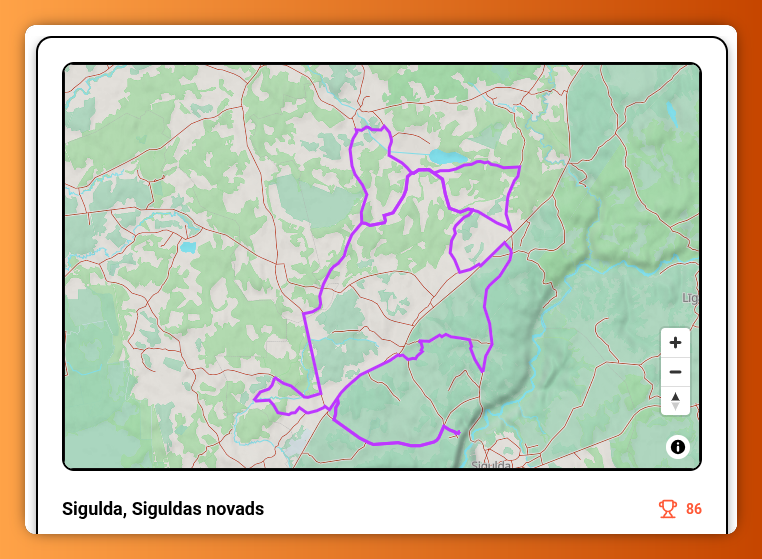

# Ridi Update 2

**Hey riders!**

I've been hard at work testing Ridi routes, listening to your feedback and making improvements and fixes.

## Here's what's new

Checkout the bullet point list of improvements and fixes and a more detailed explanation down below in case you are interested in the details.

### Features

- **Residential areas**. The router now analyses the map data and identifies and prioritises roads that are not close to residential areas
- **No-go areas**. Military areas are now identified and marked as _no-go_ and the router now avoid those
- **Score calculation**. The score calculation now takes chosen rule set into consideration to better reflect the rider's preferences
- **Motorways rules**. New rule introduced to avoid riding a certain strip of motorway in both directions
- **Round trip improvements**. The algorithm for finding round trips now finds less confusing routes and offers more options

### Fixes

- **Destination traffic only** roads are now avoided. Destination traffic is often marked with signage like [this](https://berniem.csdd.lv/content/images/berni/302.jpg)
  or [this](https://upload.wikimedia.org/wikipedia/commons/thumb/5/51/CA-BC_road_sign_R-012-T.svg/800px-CA-BC_road_sign_R-012-T.svg.png). OSM data tag info can be found [here](https://wiki.openstreetmap.org/wiki/Tag:access%3Ddestination)
- **Round trip** now never uses the same roads twice. Previously the router would often use the same road multiple times in both directions leading to confusing routes

## Detailed info

### Residential areas

The router now analyses every road and checks how many residential buildings there are within a 500m radius. If there are residential buildings, it calculates the total area of the found buildings and if they cover more than 10% of the 500m radius, the road is considered to be in residential proximity.

This approach identifies larger towns and cities, but ignores tiny villages and isolated dwellings. It also de-prioritizes roads that might not be technically within city limits but realistically are too close to residential areas for safe and fun riding.

Here is a visual representation of the classified roads of the [Brandenburg](https://www.openstreetmap.org/#map=9/52.410/13.105)

And a smaller town [Baruth](https://www.openstreetmap.org/#map=14/52.03446/13.49855) where an even smaller town (Kemlitz) is not marked in red (residential) as it's too small

The router now tries to avoid there residential-adjacent roads while creating a route but if they are unavoidable, the router will not attempt to find "fun" roads but try to exit the residential area as quickly as possible.

This should reduce routes where the algorithm tried to find fun roads within cities or densely populated areas, like the example below around [Birmingham](https://www.openstreetmap.org/#map=13/52.49057/-1.92012)

### No-go areas

Military areas are now identified and classified as no-go. No-go areas are excluded from the route generation.

While working on the no-go and military areas I've discovered that the mapping data and reality does not always match. So I've had to include a border zone of a 100m so a road that sits just inside a military zone is not considered no-go. Here is an example that I've ridden and that's allowed to be ridden but technically is within a military zone. The 100m border zone should account for these exceptions.

I would love to hear from anyone who might know of other areas that should be considered no-go, please come to this [Reddit thread here](https://www.reddit.com/r/ridiapp/comments/1lj3dql/help_military_areas_and_other_off_limit_areas/) and let me know!

### Fun score calculation

The fun score is calculated by counting the total degrees of direction change per km ridden, excluding junctions. So windy roads will generate a high score but straight roads will calculate a low score and city riding from one traffic light to the next will add nothing to the score.

Now the score calculation also includes checks for the chosen rule set. For example, the dual sport rule set favours tracks and unpaved surfaces so a windy unpaved road will generate a higher score than a similarly windy paved road. But a windy unpaved track will generate an even higher score.

In addition to the above, now also residential-adjacent roads will not add to the score.

The app only surfaces the highest scored routes for different distances so these changes should surface routes that better match the chosen rule set to improve the riding experience!

### Round trips

Round trip generation got a bit of an overhaul as it had several problems.

It would often use the same road several times leading to confusing routes, like the example below. It is impossible to know how this route is supposed to be ridden and also it would be a bit boring to ride the same roads several times even if in the opposite direction.

This is now changed and it will never attempt to use the same road again.

Round trip generation would also often end in no found routes if there was a geographical barrier in the chosen direction like a mountain range, large river with no crossings or sea. This is also now addressed by loosening the directions restriction - if the exact direction has resulted in no or very few routes, the generation will restart and choose a different direction to offer more choices. This does make the route generation longer but ultimately should result in at least a few routes to choose from!

### Motorway directions

The routing algorithm does not allow the same road to be used several times. But this rule broke down on a motorway with a dividing area between the directions. The new rule now tries to identify motorways by checking if the dividing area is less than 50m wide. If it is, it will consider it to be part of the same motorway and now allow it to be travelled multiple times.

## Future improvements

I will continue listening to feedback and keep riding myself but at this point it feels like the route generation algorithm is in a good state. It needs wider testing and feedback before I can come up with further concrete improvements.

So for the next bit I will be focusing on the App, improving the App speed and smoothness and adding features. Would greatly appreciate any ideas on that!

## Wrap up

It's been really fun to work on these improvements and go riding to test the new routes and iterate! And it's also been really fun chatting with riders and hearing feedback and suggestions! Keep them coming! You can reach me on the [Ridi subreddit](https://www.reddit.com/r/ridiapp) or on [BlueSky](https://bsky.app/profile/tomsjansons.bsky.social)

Have a safe one!

-Toms
